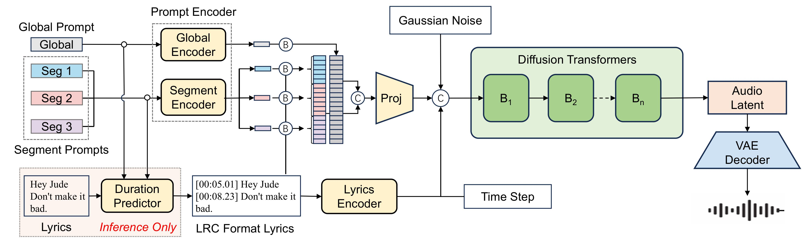

# SegTune: Structured and Fine-Grained Control for Song Generation

<p align="center">
  🎵 <a href="https://zcnyyzaglbh1.feishu.cn/wiki/LcxSwm1zCi4OSEkL2fMcQFFCn8b">Demo</a> • 📄 <a href="#citation">Paper (Coming Soon)</a> 
</p>

This repository is the official implementation for "SegTune: Structured and Fine-Grained Control for Song Generation". In this repository, we provide the training and inference scripts of the SegTune model, and evaluation pipelines.


## Abstract
Recent advances in neural song generation have enabled high-quality synthesis from lyrics and global textual prompts. However, most systems fail to model temporally varying attributes of songs, severely limiting fine-grained control over musical structure and dynamics. To address this, we propose **SegTune**, a Diffusion Transformer-based framework enabling structured and fine-grained controllability by allowing users or large language models (LLMs) to specify local musical descriptions aligned to song segments. These segment prompts are temporally broadcast to corresponding time windows, while global prompts ensure stylistic coherence. To support precise lyric-to-music alignment, we introduce an LLM-based duration predictor that autoregressively generates sentence-level timestamps in LyRiCs format. We further construct a large-scale data pipeline for high-quality song collection with aligned lyrics and prompts, and propose new metrics to evaluate segment alignment and vocal consistency. Experiments demonstrate that SegTune outperforms existing baselines in both musicality and controllability. Visit our <a href="https://zcnyyzaglbh1.feishu.cn/wiki/LcxSwm1zCi4OSEkL2fMcQFFCn8b">Demo Page</a> for more generated songs of SegTune.

## Model Architecture

<p align="center">
  
</p>

## News and Updates

* **2026.04.17 🎉**: We release the SegTune codebase, including the training and inference scripts, and evalution pipelines.

## Installation

**Requirements**: Python 3.10 is required.

To set up the environment for SegTune:

```bash
# Install espeak-ng (for phonemization)
# For Debian/Ubuntu
sudo apt-get install espeak-ng

# Create conda environment
conda create -n segtune python=3.10
conda activate segtune

# Install requirements
pip install -r requirements.txt
```


## Repository Structure

This repository contains the following main directories:

- **`src/model/`**: SegTune core model (CFM, DiT, TemporalControlDiT, Trainer)
- **`src/dataset/`**: Dataset classes for diffusion and temporal control training
- **`src/dpo/`**: Standalone DPO (Direct Preference Optimization) module
  - `dpo_cfm.py`: DPOCFM model for win/loss preference training
  - `dpo_dataset.py`: DPO dataset handling win/loss latent pairs
- **`src/dpo_jam/`**: DPO training integrated with the JAM framework
  - `dpo_cfm.py`: JAM-compatible DPOCFM model
  - `dpo_dataset.py`: JAM-compatible DPO dataset
  - `dpo_trainer.py`: DPO-specific training loop with preference metrics
  - `train_dpo.py`: DPO training entry point
- **`src/lrc_prediction/`**: Qwen3-based LRC timestamp prediction module
  - `finetuning.py`: LoRA fine-tuning script
  - `inference.py`: LRC prediction inference
  - `data_preprocessing.py`: Data preprocessing utilities
  - `configs/`: Training configurations
- **`src/lrc_gen/`**: LLM-based Composer for generating timestamped LRC
- **`src/g2p/`**: Grapheme-to-Phoneme conversion (CN/EN multilingual)
- **`src/preprocess/`**: Feature extraction and audio preprocessing
- **`infer/`**: Inference scripts
  - `pipeline.py`: End-to-end SegTune pipeline (LRC → Audio)
  - `termporal_control_infer.py`: Global and segmental control inference
  - `infer_utils.py`: Inference utilities
- **`train/`**: Training scripts
  - `temporal_control_train.py`: Temporal control training
- **`config/`**: Model configurations
- **`scripts/`**: Shell scripts for training and inference
- **`thirdparty/`**: Bundled third-party libraries (LangSegment)


## Training

### 1. Train LRC Timestamp Prediction (based on Qwen3-4B LoRA)

First, prepare your dataset in jsonl format with the following fields:
```json
{
  "lrc_path": "path/to/timestamped.lrc",
  "flamingo_struct": {
    "global_analysis": "Song description...",
    "segment_analyses": ["Verse description...", "Chorus description..."]
  }
}
```

Then configure and train:

```bash
# Edit config
vim src/lrc_prediction/configs/config.yaml

# Single GPU training
python src/lrc_prediction/finetuning.py \
    --config src/lrc_prediction/configs/config.yaml

# Multi-GPU training with accelerate
accelerate launch --config_file src/lrc_prediction/configs/accelerate_config.yaml \
    src/lrc_prediction/finetuning.py \
    --config src/lrc_prediction/configs/config.yaml
```

The fine-tuned LoRA weights will be saved to `./exps/train/fine_tuned_model/`.

### 2. Train SegTune (Latent Diffusion Model)

```bash
# Using the provided script
bash scripts/train.sh

# Or run directly with accelerate
accelerate launch --config_file config/accelerate_config.yaml \
    train/temporal_control_train.py \
    --model-config config/diffrhythm-1b_qwen3.json \
    --exp-name segtune-exp \
    --batch-size 8 \
    --max-frames 3000 \
    --learning-rate 7.5e-5 \
    --epochs 110 \
    --file-path "dataset/train.scp"
```

**Key parameters**:
- `--model-config`: Model architecture config (default: `config/diffrhythm-1b_qwen3.json`)
- `--batch-size`: Training batch size
- `--max-frames` / `--min-frames`: Audio frame range
- `--cond-drop-prob`, `--style-drop-prob`, `--lrc-drop-prob`: Dropout rates for CFG training
- `--file-path`: Path to training data list file

Trained checkpoints will be saved to `ckpts/{exp_name}/`.

## Inference

### End-to-End SegTune Pipeline

SegTune integrates LRC timestamp prediction (Qwen3 LoRA) and the diffusion model into a single pipeline:

```
Raw lyrics + Song description
          ↓
 LRC Prediction (Qwen3 LoRA)
          ↓
  Timestamped .lrc file
          ↓
SegTune (Latent Diffusion)
          ↓
   Full-length song audio
```

#### Usage

**Note**: `--jsonl-path` and `--lrc-path` are mutually exclusive (choose one).

```bash
# Method 1: Full pipeline (jsonl → LRC prediction → audio generation)
python infer/pipeline.py \
    --jsonl-path datasets/test/test.jsonl \
    --output-dir infer/example/output
# --lrc-model-name and --lrc-lora-dir have default values, override if needed

# Method 2: Skip LRC prediction, directly generate audio from existing .lrc file
python infer/pipeline.py \
    --lrc-path infer/example/input.lrc
```

## Acknowledgments

We thank the following open-source projects that make SegTune possible:

- **[DiffRhythm](https://github.com/ASLP-lab/DiffRhythm)** ([ASLP-lab](https://github.com/ASLP-lab), NWPU): The foundational latent diffusion model for full-length song generation.
- **[Qwen3](https://github.com/QwenLM/Qwen3)** (Alibaba): The base language model for LRC timestamp prediction.
- **[F5-TTS](https://github.com/SWivid/F5-TTS)** (SWivid): The Conditional Flow Matching (CFM) training and inference framework adapted for audio generation.
- **[Amphion](https://github.com/open-mmlab/Amphion)** (OpenMMLab): Audio processing utilities and evaluation metrics.
- **[ms-swift](https://github.com/modelscope/ms-swift)** (ModelScope): Training framework for LLM fine-tuning.
- **[MuQ](https://github.com/OpenMuQ/MuQ)** (OpenMuQ): MuQ-MuLan audio-language contrastive model used as the style/audio prompt encoder.
- **[LangSegment](https://github.com/juntaosun/LangSegment)** (juntaosun): Multilingual text segmentation library used in the G2P pipeline for mixed-language lyric processing.
- **[phonemizer](https://github.com/bootphon/phonemizer)** (bootphon): Multilingual text-to-phoneme conversion via the eSpeak-NG backend, used in G2P processing.


